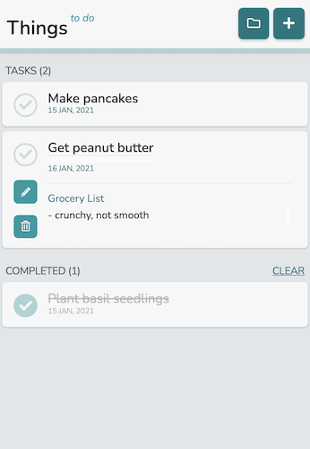

# _Things To Do_

This is a basic "to-do list" application that allows users to perform CRUD actions on their tasks in localStorage.

:zap:[Live Demo](https://kuosandys.github.io/todo-list):zap:

## Features

The tasks are displayed as cards that expand to reveal more information, as well as options to delete or edit the task. The completion checkbox can be easily toggled on or off, and the appearance of the task changes to convey completion status clearly. The completed tasks are moved into a separate section at the bottom of the page, with an option to quickly clear and delete all completed tasks. The total number of tasks are indicated next to the section headings.

The add ("+") button at the top right corner displays a form for users to add new tasks. The project button (with a project folder icon) displays a list of current projects so the user can easily view tasks for each project.

## Purpose

This project was built to demonstrate understanding of OOP principles such as loose coupling and single responsibility. The application is split into 3 major modules that handle the data storage, display rendering, and application logic respectively. The objects are designed using factory functions to implement a way to separate public and private methods.

Webpack is used to manage the modules used in the project and to build the final JavaScript file. This included compiling Sass to CSS, using Babel to transpile JavaScript, and ESLint and Prettier to style JavaScript.

The UI of this application was built with focus on design principles such as using a set of pre-defined font sizes and colours, keeping border radius consistent, and using box shadows to illustrate element hierarchy. The aim was to build a UI that allows users to easily find the action they are looking to do, but with an uncluttered appearance. The CSS is "reset" using [normalize.css](https://necolas.github.io/normalize.css/) and the dates displayed in the application are formatted using [date-fns](https://github.com/date-fns/date-fns). The interface was built from a "mobile-first" approach.

## Built With

- JavaScript (Vanilla, linted with ESLint and formatted with Prettier, transpiled with Babel)
- CSS (compiled from Sass, reset with normalize.css)
- HTML
- webpack

## Sources

This project was built as part of The Odin Project's JavaScript Curriculum. Project guidelines can be found [here](https://www.theodinproject.com/courses/javascript/lessons/todo-list).

## Future Features

The following are a list of features planned for the future:

- sorting/filtering option for tasks (e.g. by date)
- priority marking for tasks
- ~~UI design optimized for larger screens~~
- UI optimizations (e.g. displaying current project folder being viewed more clearly, CSS transitions)
- dark theme or other colour themes for UI
- ~~a list of default tasks for first-time users to walk them though the app~~
